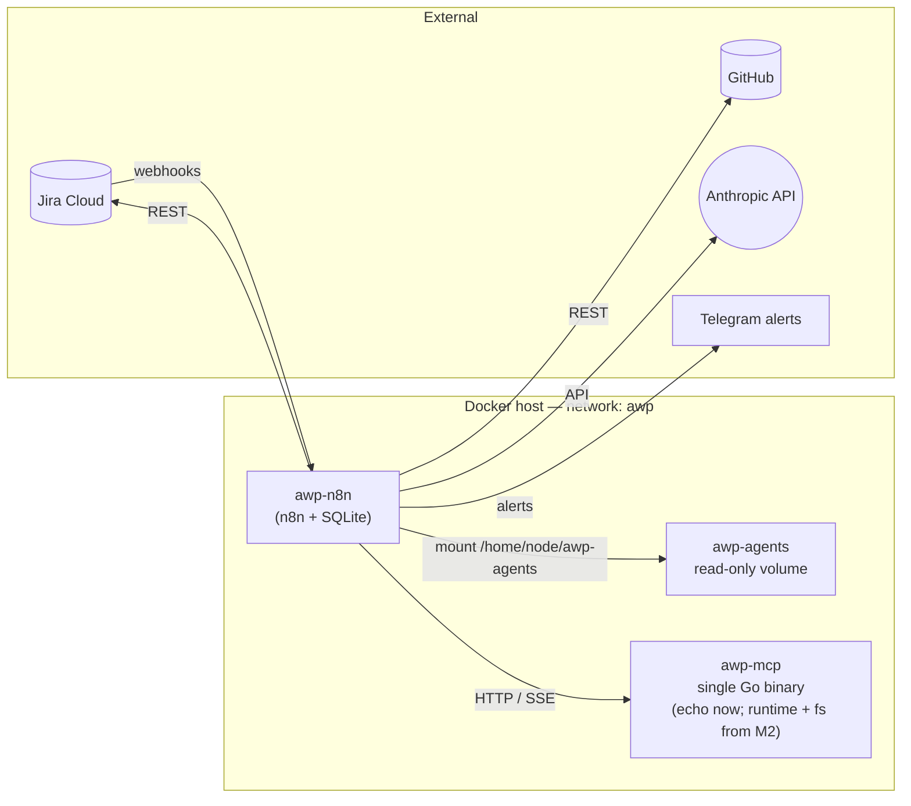

# awp-n8n

n8n (Community, self-hosted) workflow host for the **AWP** project — and the *only* execution engine in the system. Workflows here orchestrate agents (Anthropic via the `AI Agent` node), call tools (MCP servers as sibling containers), persist coordination state in Jira, and react to webhooks / chats / crons.

## Status

- **M0** — done. Smoke test (`00_hello_world`) passes: webhook → read from mounted `awp-agents` → call `echo-mcp` on the shared Docker network → JSON response. See `n8n/workflows/README.md` for the verifying `curl`.
- **M1+** — see Roadmap at the bottom.

## Where this repo fits

AWP is three sibling repos plus Jira/GitHub/Anthropic externally:



- **`awp-agents`** (sibling repo): role artifacts (prompts, configs, pricing, calibration). **Mounted read-only** into the n8n container at `/home/node/awp-agents`.
- **`awp-mcp`** (sibling repo): MCP servers for the **agent's working environment only** — filesystem, shell sandbox, code intel. Consumed via the `MCP Client` node by the `AI Agent` inside its own loop. *Not* used for Jira / GitHub / Telegram — those go through native n8n nodes.

### Tools split into two layers

| Layer | Caller | Mechanism | Auth | Examples |
|---|---|---|---|---|
| **L1 — workflow plumbing** | n8n workflow (deterministic) | native n8n nodes | n8n Credentials | `Jira Software Cloud`, `GitHub`, `Telegram`, `HTTP Request` |
| **L2 — agent's environment** | the model itself (exploratory) | `MCP Client` → `awp-mcp` | none required (workspace-scoped) | filesystem, shell sandbox, grep |

The AI Agent node can attach native n8n nodes as tools too — meaning even when the model "picks" a Jira action, the call still runs through n8n's Jira node with n8n Credentials, not via MCP. This keeps credential bookkeeping single-sourced and gives every call a debuggable execution panel in the editor.

## Layout

```
docker-compose.yml         # n8n only (Community, SQLite, persistent volume)
docker-compose.dev.yml     # dev overlay: mounts ../awp-agents and builds ../awp-mcp/echo-mcp
.env.example               # required env vars (N8N_ENCRYPTION_KEY, TZ, ports)
n8n/
  workflows/               # importable workflow JSONs (mounted read-only at /home/node/workflows)
submodules/   (M2+ idea)   # eventual home of awp-agents and awp-mcp as git submodules
infra/        (M5+)        # traefik / backups / cloud-migration assets
```

State persistence: n8n keeps workflows, executions, credentials in the named Docker volume `awp_n8n_data` (mounted at `/home/node/.n8n`). `docker compose down` is safe; `down -v` wipes everything.

## M0 quick start

The three repos sit next to each other on disk:

```
~/Dev/ai/awp/
├── awp-n8n/      <- you are here
├── awp-agents/   (artifacts: prompts, configs)
└── awp-mcp/      (MCP servers)
```

1. **Prepare `.env`** (generate a strong key):

   ```bash
   cp .env.example .env
   # then edit .env: N8N_ENCRYPTION_KEY=$(openssl rand -hex 32)
   ```

2. **First boot** (n8n + echo-mcp + workflow-sync sidecar, with `awp-agents` mounted into n8n):

   ```bash
   docker compose up --build
   ```

   `.env` sets `COMPOSE_FILE=docker-compose.yml:docker-compose.dev.yml`, so plain `docker compose ...` invocations from this directory automatically merge the dev overlay. (Without that var, services from the overlay — `n8n-import`, the `awp-agents` mount, `echo-mcp` — wouldn't be visible and `docker compose run --rm n8n-import` would fail with `no such service: n8n-import`.)

   On the very first boot the sidecar can't do anything yet (no `N8N_API_KEY`) — it prints a help message and exits with code 0. n8n itself is up and accessible.

3. Open <http://localhost:5678>, **complete the one-time owner setup**, then **create the n8n API key**: `Settings → n8n API → Create an API key`. Paste the key into `awp-n8n/.env`:

   ```bash
   N8N_API_KEY=eyJhbGc…
   ```

4. **Run the sidecar** (creates the workflows under your owner account and activates them):

   ```bash
   docker compose run --rm n8n-import
   ```

   Expected output: one `created` (or `updated`) and one `activated` line per workflow JSON. Webhook listeners are now registered in the live n8n process.

5. **Verify** from the host:

   ```bash
   curl -s -X POST http://localhost:5678/webhook/hello \
     -H 'content-type: application/json' \
     -d '{"hello":"world"}' | jq
   ```

   Expected JSON includes:
   - `agents_mounted: true`, `agents_file_name: "README.md"` — proves the `awp-agents` volume is mounted and readable from inside a workflow.
   - `echo_mcp.echo.text: "from n8n"` — proves the MCP-server container is reachable by service name.

   Both present ⇒ M0 closed.

## M1 prerequisites

To run the M1 workflow (`01_pm_intake.json`, Jira → PM decomposition) the following setup needs to be done **once**. None of these are needed for M0.

### Identity model (read this first)

Each automated role runs under its own **Atlassian service account** (per-role audit trail, native `assignee`-based routing from M2). Service accounts on Atlassian Cloud are non-human accounts that **do not consume the 10-seat Free-tier user limit** — every org gets 5 of them for free, which fits AWP exactly (4 used, 1 spare).

| Role | Service account | `accountId` (recorded) | n8n credential | Comes online |
|---|---|---|---|---|
| `pm` | `awp-pm` | `712020:5a2a8ccc-e479-49a1-9965-2748d01d9d26` | `jira:awp-pm` | M1 |
| `classifier` | borrows `awp-pm` | — | — | M2 |
| `dev` | `awp-dev` | `712020:88195866-6d79-4da8-a642-e559cd055709` | `jira:awp-dev` | M2 |
| `qa` | `awp-qa` | `712020:3643c5de-b750-4046-908d-0bc55051ad03` | `jira:awp-qa` | M3 |
| `devops` | `awp-devops` | `712020:4e757014-d33f-4d1e-acf4-1c0eb3c2848f` | `jira:awp-devops` | M3 |
| `reviewer` | borrows `awp-dev` (default; pending confirmation) | — | — | M3 |

All four service accounts are created up-front in M1 (cheap — single admin screen, no email aliases needed). The canonical mapping (workspace, accountIds, credential names) lives in `awp-agents/agents/shared/jira-accounts.yaml` — **this file is gitignored** because it contains workspace-specific identifiers. Bootstrap from the committed template:

```bash
cd awp-agents/agents/shared
cp jira-accounts.yaml.example jira-accounts.yaml
cp jira-fields.yaml.example   jira-fields.yaml
# edit both, replacing TODO placeholders with your values
```

API tokens and n8n credentials are added per-role as agents come online — M1 only needs `jira:awp-pm`.

### Jira Cloud setup (one-time)

1. **Workspace + project** — sign up for Jira Cloud Free if not already. Create a project (Scrum or Kanban; doesn't matter). Note the workspace domain (`<workspace>.atlassian.net`).
2. **Service accounts** — `admin.atlassian.com → Directory → Service accounts → Create service account`. Create all four: `awp-pm`, `awp-dev`, `awp-qa`, `awp-devops`. For each:
   - Grant **product access to Jira**.
   - In the Jira project: assign **Developer** role (create issues, transition, comment).
   - Copy the `accountId` and record it in `awp-agents/agents/shared/jira-accounts.yaml`.
   - For `awp-pm` only (M1): in the same admin page, **Credentials → Create credentials → API Token**, name it (e.g. `n8n-awp-pm`), and pick the following scopes:
     - `read:jira-work` — search issues, list transitions, read comments
     - `write:jira-work` — create issues, add comments, label, transition
     - `read:jira-user` — resolve `currentUser()` in JQL

     Save the token immediately — Atlassian shows it once.

     **Critical caveat**: service-account API tokens are *scoped tokens* and **cannot authenticate against `<workspace>.atlassian.net`** — they return 401. They only work against the gateway `https://api.atlassian.com/ex/jira/<cloudId>/...` with `Authorization: Bearer <token>`. All Jira HTTP Request nodes in our workflows are wired to that endpoint. See <https://support.atlassian.com/atlassian-cloud/kb/401-unauthorized-error-when-service-account-accesses-jira-or-confluence-api/>.

3. **Workspace `cloudId`** — one-time, public lookup (no auth needed):

   ```bash
   curl -s https://<workspace>.atlassian.net/_edge/tenant_info
   # → {"cloudId": "<uuid>"}
   ```

   Paste the value into `awp-n8n/.env` as `JIRA_CLOUD_ID=<uuid>`. The workflow's `Set Jira workspace` Code node fails fast if this env var is missing or not a UUID. `cloudId` is stable per workspace.

4. **Issue type hierarchy** — `Project settings → Issue types`. Confirm **Epic**, **Story**, **Bug**, and **Subtask** are all enabled (defaults in any team-managed Jira project). In M1 the PM workflow watches **Epics with `assignee = awp-pm`** and creates **Stories** with `parent.key` set to the Epic (native Epic-Link mechanism in team-managed projects — no custom field, no Epic Link customfield). Stories and Bugs filed directly are not picked up until Classifier ships in M2.

5. **Board and statuses** — use the **default team-managed workflow** as-is. Jira ships these five statuses, all visible as columns on the Kanban board:

   | Status | Column | Set by |
   |---|---|---|
   | `To Do` | 1 | Default for new issues (Epic / Story / Bug). PM trigger watches Epics here filtered by `assignee = awp-pm`. Stories created via REST also land here. |
   | `In Progress` | 2 | PM transitions the Epic here after decomposition; executing agent (M2+) once it picks up a Story. |
   | `PR` | 3 | Dev after opening a PR; QA / reviewer working. |
   | `Ready to Merge` | 4 | All checks/reviews green, awaiting human merge. |
   | `Done` | 5 | After merge. |

   > **No `Backlog` status.** Jira's "Backlog" is a tab in the project sidebar (a view, not a status); the default team-managed workflow does not include a `Backlog` status and we don't need one. Epics live not on the board but in the **Backlog tab → Epics panel** on the right side — expand if collapsed, or filter by `Type = Epic` in JQL.

6. **Label `Needs_Clarification`** — used by PM in its failure path instead of a dedicated status. When PM can't decompose an Epic, the Epic stays in `To Do` with `assignee = awp-pm`, gets this label, and PM posts its questions as a comment. The PM trigger excludes Epics carrying this label, so the ticket sits quietly until you remove the label.

7. **Custom fields** — **internal IDs (`customfield_NNNNN`) are the only thing the Jira REST API knows about**. Display names are cosmetic — rename in `Project settings → Custom fields → ⋯ → Edit name` any time without breaking anything. Workflows reference fields by semantic key; the canonical mapping (semantic key → `customfield_NNNNN` + display name) lives in `awp-agents/agents/shared/jira-fields.yaml`. Proposed names:

   | Semantic key (code) | Display name (Jira UI) | Type | Filled by |
   |---|---|---|---|
   | `role` | **AWP Role** | Single-select: `pm`, `classifier`, `dev`, `qa`, `devops`, `reviewer` | Classifier / PM |
   | `tier` | **AWP Tier** | Single-select: `L1`, `L2`, `L3` | Classifier / PM |
   | `acceptance_criteria` | **AWP Acceptance Criteria** | Long text (multi-line) | PM |
   | `estimate_input_tokens` | **AWP Estimated Input Tokens** | Number | Classifier / PM |
   | `estimate_output_tokens` | **AWP Estimated Output Tokens** | Number | Classifier / PM |
   | `actual_input_tokens` | **AWP Actual Input Tokens** | Number | (M2+) executing agent |
   | `actual_output_tokens` | **AWP Actual Output Tokens** | Number | (M2+) executing agent |
   | `actual_cost_usd` | **AWP Actual Cost (USD)** | Number | (M2+) executing agent |

### Who picks up what (M1)

The workflow routes by **issue type + assignee**, so the user-visible contract is *what you file and how you assign it*:

| You file (status `To Do`) | + assignee | + AWP Role | Picked up by | Milestone | What happens |
|---|---|---|---|---|---|
| **Epic** | `awp-pm` | n/a | PM agent | M1 | Decomposes into ≤ 10 Stories linked via `parent`, fills role / tier / acceptance criteria / estimates, sets `assignee` to the role's service account. Epic transitions `To Do → In Progress`. |
| **Story** | unassigned | empty | Classifier | M2 | Fast track: fills role / tier / estimates, no decomposition. |
| **Bug** (reporter ≠ `awp-qa`) | unassigned | empty | Classifier | M2 | Same fast track as Stories — applies to human-filed defects (production issues, user reports). |
| **Bug** (reporter = `awp-qa`) | `awp-dev` (pre-filled) | filled (pre-filled) | (none — bypasses Classifier) | M3+ | The QA agent fills the AWP fields itself when reporting and assigns the Bug to `awp-dev`, so it lands as a normal Dev task. |
| **Story** or **Bug** | `awp-dev / awp-qa / awp-devops` | filled | Executing agent | M2+ | Dev / QA / DevOps picks up by `assignee` and moves status through the board. |

In M1 the PM trigger JQL is:

```
project = ATF AND type = Epic AND status = "To Do" AND assignee = currentUser() AND (labels IS EMPTY OR labels NOT IN (Needs_Clarification))
```

`currentUser()` resolves to whatever Jira account the n8n credential is for — i.e. `awp-pm`. So **to have PM pick up an Epic, just set its `assignee` to `awp-pm`**. Stories and Bugs filed directly are *not* picked up until Classifier ships in M2.

### Anthropic (one-time, in console.anthropic.com)

1. Sign up; top up $10–20 of balance.
2. Generate an API key.

### n8n Credentials (one-time, in n8n UI at <http://localhost:5678>)

**Credential naming convention.** Credentials follow `<type>:<scope>` lowercase, colon-separated:
- `anthropic` — single shared Anthropic API key (no per-role split; the AI Agent node picks the model, the key is the same).
- `jira:<role>` — one per Jira-touching role (`jira:awp-pm`, `jira:awp-dev`, …) so each agent acts under its own service account.
- Future credentials follow the same shape: `github:<role>`, `telegram`, etc.

`Credentials → Create New`:

1. **`anthropic`** (type `Anthropic API`) — paste your Anthropic API key.
2. **`jira:awp-pm`** (type **`HTTP Header Auth`**, NOT `Jira Software Cloud API`):
   - `Name` = `Authorization`
   - `Value` = `Bearer <scoped-token>` (the scoped API token you minted for `awp-pm` in admin.atlassian.com — include the literal `Bearer ` prefix with a single space)

   **Why HTTP Header Auth and not Jira Software Cloud API?** Atlassian service accounts can only generate **scoped** API tokens, and scoped tokens 401 against `<workspace>.atlassian.net`. The only working endpoint is `https://api.atlassian.com/ex/jira/<cloudId>/rest/api/...` with `Authorization: Bearer <token>`. n8n's built-in `Jira Software Cloud API` credential is hard-coded to do Basic auth against the workspace domain, so we bypass it entirely and use `HTTP Header Auth` instead. See [the Atlassian KB on this 401](https://support.atlassian.com/atlassian-cloud/kb/401-unauthorized-error-when-service-account-accesses-jira-or-confluence-api/).

3. Per-role Jira credentials (`jira:awp-dev`, `jira:awp-qa`, `jira:awp-devops`) are added as those roles come online in M2/M3, each as a `HTTP Header Auth` credential with its own scoped token.

(The n8n API key for the sidecar is a separate thing, covered in *Workflow sync* below.)

### Roles registered in M1

`awp.role` Jira enum maps 1:1 to folders under `awp-agents/agents/`:

| Role id | Authored in | First used by | Service account | Input it watches |
|---|---|---|---|---|
| `pm` | M1 | `01_pm_intake.json` | `awp-pm` | Epic, `status = "To Do"`, `assignee = awp-pm`, no `Needs_Clarification` label |
| `classifier` | M2 | `02_classifier.json` | shares `awp-pm` | Story or Bug, `awp.role` empty, `reporter != awp-qa` for Bugs |
| `dev` | M2 | `03_dev_loop.json` | `awp-dev` | Story `assignee = awp-dev` |
| `qa` | M3 | `03_dev_loop.json` (handoff) | `awp-qa` | Story `assignee = awp-qa` |
| `devops` | M3 | `04_review_debug.json` | `awp-devops` | Story `assignee = awp-devops`; red CI |
| `reviewer` | M3 | `04_review_debug.json` | shares `awp-dev` | GitHub PR event, not Jira |

Each role is an open enum entry — adding a new one is `mkdir agents/<role>/` + Jira-side enum value + entry in `awp-agents/agents/shared/jira-accounts.yaml` + routing in workflows. No code changes.

## Workflow sync (auto-import + auto-activate)

Workflow JSONs live under `n8n/workflows/`. The `n8n-import` sidecar in `docker-compose.dev.yml` runs the script at `scripts/sync-workflows.js` after n8n becomes healthy. It uses n8n's **public REST API** (not the `n8n import:workflow` CLI) and does, per file:

1. `GET /api/v1/workflows` — enumerate existing workflows once.
2. If a workflow with the same `name` exists → `PUT /api/v1/workflows/<id>` to update.
   If not → `POST /api/v1/workflows` to create (owned by the API key's user).
3. `POST /api/v1/workflows/<id>/activate` (if JSON has `"active": true`), or `…/deactivate` (if `"active": false`). This is what registers webhook listeners in the running n8n process.

Why REST and not CLI: `n8n import:workflow` (a) imports workflows **without an owner** — they end up orphaned and produce `User attempted to access a workflow without permissions` in the UI; (b) forcibly **deactivates** workflows on import, so webhook listeners never come up. Both problems disappear when using the API under the owner's key.

**Matching is by `name`**, not by the top-level `id` in the JSON — n8n's API generates its own IDs on create, so name is the only durable handle. Keep workflow names unique inside `n8n/workflows/`.

Without `N8N_API_KEY` the sidecar exits cleanly with a help message and does nothing — set the key first (see [M0 quick start](#m0-quick-start)).

### Editor session traps (read this when n8n "lies" to you)

n8n's editor keeps node outputs in **browser session state**, decoupled from the server-side workflow. Consequences that have bitten this project hard:

- **Stale outputs survive workflow edits.** After re-syncing the workflow JSON via the sidecar or editing nodes in the UI, the OUTPUT pane may still show the previous execution's result — even though the server-side workflow definition is brand-new. Token "Last used" timestamps on the upstream API stay frozen because no real request is fired.
- **Pinned data is *not* always visible via the public API.** A node can have an editor-only pinned output that doesn't appear in `GET /api/v1/workflows/{id}` (`pinData` returns `{}`). The pin lives only in your browser session.
- **`Execute step` uses the cached upstream outputs**, not a fresh execution from the Schedule Trigger. `Execute workflow` runs from the start but still respects pinned data.

When n8n's behaviour stops matching reality (works in shell, fails in n8n; same auth header but different responses; outputs that don't update after edits), the diagnostic is always the same:

```
Cmd+Shift+R   (hard browser refresh)
```

This drops the editor session, re-fetches the saved workflow from the server, and clears any stuck cached outputs. After the refresh, click `Set Jira workspace` → `Execute step` first to populate upstream outputs, then `Execute step` on downstream nodes.

Avoid manually pinning data unless you're explicitly testing — every pin is a future debugging session waiting to happen.

### Credential resolution (name → id) at sync time

n8n's node-credentials blocks look like this in JSON:

```json
"credentials": {
  "httpHeaderAuth": {
    "id": "DBt1WVqzfoKY4adQ",
    "name": "jira:awp-pm"
  }
}
```

n8n indexes credentials by **id** internally; the `name` field is informational. If a workflow is imported with only `name` and no `id`, n8n raises `Found credential with no ID` at execution time. (Some built-in credential types — `jiraSoftwareCloudApi`, `anthropicApi` — auto-resolve by name as a legacy compatibility; generic types like `httpHeaderAuth` do not.)

To keep workflow JSONs in this repo human-readable (no UUID gore committed alongside the rest), the sidecar fetches `GET /api/v1/credentials` at startup, builds a `(type, name) → id` map, and walks every workflow node's `credentials` block to inject the `id` before pushing. Each workflow log line includes `resolved N credential reference(s) to IDs`.

If a workflow references a credential by name that doesn't exist in n8n yet, the sidecar logs a `WARNING` line listing the missing `(node, type, name)` and skips that single reference; the workflow imports successfully but will 4xx at execution time until you create the credential in the UI.

This means: **adding a new credential is always a UI step first** (Settings → Credentials → New) — there is no provisioning side of the sidecar. The workflow JSON refers to the credential by `name` (e.g. `jira:awp-pm`) and the sidecar fills in the `id` on every sync.

### `{{INCLUDE:relative/path}}` markers (workflow templating)

Before pushing each workflow JSON to n8n, the sidecar walks every string field and replaces `{{INCLUDE:relative/path/to/file}}` markers with a **JS string literal** (i.e. JSON-stringified contents) of that file. Paths are resolved relative to `INCLUDE_BASE_DIR` (`/home/node/awp-agents` in the dev overlay) and may not escape it.

Typical use: bake a long static text artifact — e.g. an agent's `system.xml` prompt — into a Code node at sync time, so the workflow JS sees a normal string constant. The source pattern in the workflow JSON looks like:

```js
const systemPrompt = {{INCLUDE:agents/pm/prompts/system.xml}};
```

…which the sidecar turns into:

```js
const systemPrompt = "<system_prompt name=\"awp-pm\">\n\n<role>\nYou are AWP's…";
```

Why this exists: n8n 2.21+ runs Code nodes in a separate Task Runner with `binaryDataMode=filesystem` — cross-node binary access (`$('Read File').first().binary.X.data`) returns lazy references without the actual bytes, so reading a file via the `Read/Write Files from Disk` node and consuming it in a downstream Code node *does not work*. Baking text artifacts in at sync time sidesteps the whole class of binary-data-propagation bugs.

Iteration loop for editing a baked-in file:

```bash
$EDITOR ../awp-agents/agents/pm/prompts/system.xml
docker compose run --rm n8n-import
# n8n now has the updated jsCode; open the workflow and Execute step
```

The local workflow JSON keeps the marker (it's the source of truth); only n8n's internal copy ever contains the expanded form. Don't round-trip workflow JSONs back to disk via the n8n UI's *Download* button after they've been synced — that would write the expanded prompt over the marker, breaking iteration.

### Adding a new workflow

1. Author / export the JSON.
2. Give it a **unique `name`** (this is the sync key). Optional top-level `id` is informational only.
3. Avoid hardcoding `webhookId` on Webhook nodes — leave it out so n8n assigns one.
4. Set `"active": true` to have it activated automatically (or `false` for drafts).
5. Drop into `n8n/workflows/NN_descriptive_name.json`.
6. `docker compose up`, or `docker compose run --rm n8n-import` for an ad-hoc re-sync.

### Editing a workflow (round-trip)

1. Edit in the n8n editor at <http://localhost:5678>.
2. `…` menu → `Download` → save over the matching `NN_*.json`. Keep the `name` field stable (it's the sync key).
3. **If the workflow contained `{{INCLUDE:…}}` markers**, restore them by hand before committing — the downloaded JSON contains the expanded form (the marker was lost during sync). Diff against the previous version to spot the inlined block.
4. `git commit`. The next `docker compose up` re-syncs.

### Triggering sync manually

```bash
docker compose run --rm n8n-import
```

Idempotent. Safe to run any time n8n is healthy. Re-running with no changes prints `(likely already in state)` per workflow and exits.

## Configuration

`.env` consumed by `docker-compose.yml` (see `.env.example` for defaults):

| Variable | Purpose |
|---|---|
| `N8N_ENCRYPTION_KEY` | 32-char random string used to encrypt credentials at rest. **Required.** |
| `TZ` | Time zone used by cron triggers. |
| `N8N_HOST`, `N8N_PORT`, `N8N_PROTOCOL`, `WEBHOOK_URL` | Where the editor / webhooks are exposed. |
| `ECHO_MCP_PORT` | External port for `echo-mcp` when run standalone (M0 only). |

Anthropic API keys, Jira/GitHub PATs, Telegram tokens go into **n8n Credentials** (created from the editor), *not* `.env`. Rationale: credentials are encrypted at rest with `N8N_ENCRYPTION_KEY` and never leave the SQLite store.

## Workflows

See [`n8n/workflows/README.md`](n8n/workflows/README.md) for the current inventory and import instructions. Workflow JSONs are version-controlled here; production workflows live inside n8n's SQLite store and are imported via the editor's `Import from File…` action.

## n8n operational notes (gotchas)

Things that bit us during M0 and are worth keeping handy:

- **File-access whitelist.** `Read/Write Files from Disk` is restricted to `/home/node/.n8n-files` by default. The dev overlay opens up the mounted volume: `N8N_RESTRICT_FILE_ACCESS_TO=/home/node/awp-agents`. Multiple paths separated by `;`. Requires container restart to apply.
- **Expression syntax.** A field starting with `=` enables expression mode, but JS is only evaluated inside `{{ … }}`. `={ "a": $('X').item.json }` is parsed as literal text and breaks JSON-body fields. Always wrap as `={{ JSON.stringify({...}) }}`.
- **Avoid `respondWith: "json"` for dynamic bodies.** Behaviour with object-returning expressions varies across n8n versions (sometimes empty body, sometimes double-encoded). Use `respondWith: "text"` + `JSON.stringify(...)` + explicit `Content-Type: application/json` in `responseHeaders`.
- **Re-import after rename.** Renaming a node inside an already-active workflow can leave dangling references and surface as `Node not found` in the editor. Delete the workflow in the UI, reload, re-import the updated JSON.
- **No custom n8n nodes.** Everything in AWP is built with stock nodes: `Webhook`, `Chat Trigger`, `HTTP Request`, `AI Agent`, `MCP Client`, `Read/Write Files from Disk`, `Respond to Webhook`, `Telegram`, `Code` (sparingly).

## Switching to git submodules (later)

When we want `awp-agents` and `awp-mcp` to live inside this repo's tree (single-checkout convenience):

```bash
git submodule add git@github.com:realdnchka/awp-agents.git submodules/awp-agents
git submodule add git@github.com:realdnchka/awp-mcp.git    submodules/awp-mcp
```

Then change the volume mount and build context in `docker-compose.dev.yml` from `../awp-agents`/`../awp-mcp/...` to `./submodules/awp-agents`/`./submodules/awp-mcp/...`. Nothing else changes.

## Roadmap

- **M0 — Skeleton.** Done. Smoke test passes.
- **M1 — Jira intake + PM (Layer-1 only, no MCP added).** PM polls Epics with `assignee = awp-pm` and `status = "To Do"` (via a Schedule trigger + Jira search node, both running on the `jira:awp-pm` credential), decomposes each Epic into ≤ 10 Stories via an HTTP Request node calling `POST /rest/api/2/issue` (the native Jira node silently ignores `parentIssueKey` for non-subtask issuetypes, so we go direct), fills the AWP custom fields (`AWP Role`, `AWP Tier`, `AWP Acceptance Criteria`, `AWP Estimated Input Tokens`, `AWP Estimated Output Tokens`) and sets `assignee` on each Story to the role's service-account `accountId`. Stories land with `status = "To Do"` (Jira default for new issues); the Epic transitions `To Do → In Progress`. Vague Epics get the `Needs_Clarification` label and a comment with PM's questions, no status change. `anthropic` + `jira:awp-pm` credentials added in n8n. Field-name mapping kept in `awp-agents/agents/shared/jira-fields.yaml` (the workflow's `Parse PM output` Code node hardcodes a copy, kept in sync manually).
- **M2 — Dev happy path + Classifier + first L2 MCP.** Classifier picks up unlabeled Stories and human-filed Bugs (`type IN (Story, Bug) AND "AWP Role" IS EMPTY AND reporter != awp-qa`) via native Jira node only, fills role/tier/estimates. Bugs reported by `awp-qa` are excluded because the QA agent fills the AWP fields itself when reporting. Dev agent (as `awp-dev`) gets the first MCP handlers (`runtime` shell sandbox + `fs` filesystem) consolidated in the single `awp-mcp` Go binary. Native GitHub node opens branch + PR + posts CI status back to Jira. Every agent writes actual tokens + computes `actual_cost_usd` from `agents/shared/pricing.yaml`.
- **M3 — Review + Debug loops.** Reviewer + DevOps workflows, iteration limits (`debug=2`, `review=3` defaults), Telegram alerts on escalation (native Telegram node, one-way push only — no public endpoint needed yet).
- **M3.5 — Bidirectional PM (Jira comment webhook).** Replaces the M1 "edit Epic description → wait for poll" clarification UX with "answer in a Jira comment → PM reacts within seconds via webhook". First milestone that needs a public n8n endpoint (Cloudflare Tunnel by default; see `PLAN.md` §15). Polling in `01_pm_intake.json` stays as a fallback. Unblocks Telegram bot conversations (M7) by reusing the same endpoint.
- **M4 — Dispatcher.** `dispatch_loop` workflow + per-role caps from `.env`, atomic Jira status transitions. No broker.
- **M5 — Chat Trigger + project bootstrap.** Conversational entry point + repo template.
- **M6 — Calibration + budget. _MVP closes here._** `calibrate_estimates` cron → `agents/shared/estimates.md`. Hard stop on monthly `sum(actual_cost_usd)` + Telegram alert.
- **M7 — Telegram bot interactive UX (post-MVP).** Main menu (tasks needing attention, per-role chat), per-task threads where Telegram replies become Jira comments (re-entering via M3.5), push notifications with action buttons (`KEY-324 PR is Ready for human review · [Go to PR]`). See `PLAN.md` §16.
- **M8 — MCP-equipped chatbot for project queries (post-MVP).** Bot grows an AI Agent node with Jira MCP + GitHub MCP clients so the user can ask ad-hoc questions ("how many active tasks?", "at what stage is the project?", "how much did we spend this month?"). See `PLAN.md` §10 (M8) + §16.
