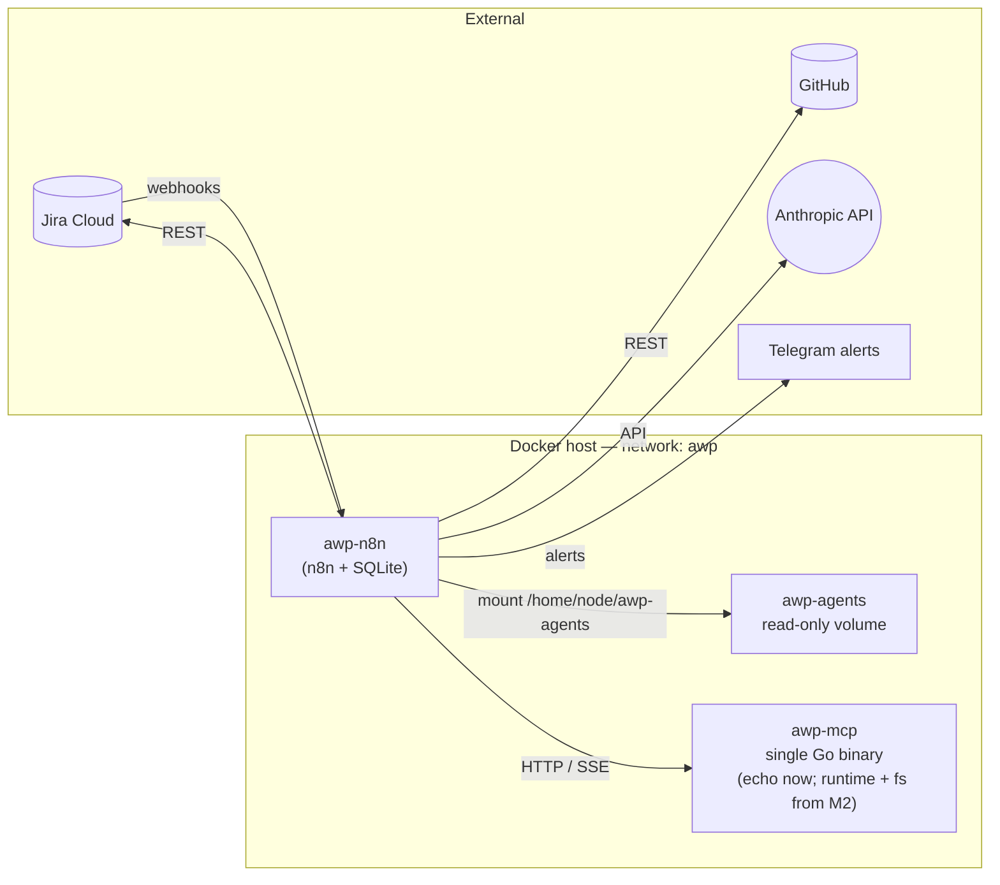

# awp-n8n

n8n (Community, self-hosted) workflow host for the **AWP** project — and the *only* execution engine in the system. Workflows here orchestrate agents (Anthropic via the `AI Agent` node), call tools (MCP servers as sibling containers), persist coordination state in Jira, and react to webhooks / chats / crons.

## Status

- **M0** — done. Smoke test (`00_hello_world`) passes: webhook → read from mounted `awp-agents` → call `echo-mcp` on the shared Docker network → JSON response. See `n8n/workflows/README.md` for the verifying `curl`.
- **M1+** — see Roadmap at the bottom.

## Where this repo fits

AWP is three sibling repos plus Jira/GitHub/Anthropic externally:



- **`awp-agents`** (sibling repo): role artifacts (prompts, configs, pricing, calibration). **Mounted read-only** into the n8n container at `/home/node/awp-agents`.
- **`awp-mcp`** (sibling repo): MCP servers for the **agent's working environment only** — filesystem, shell sandbox, code intel. Consumed via the `MCP Client` node by the `AI Agent` inside its own loop. *Not* used for Jira / GitHub / Telegram — those go through native n8n nodes.

### Tools split into two layers

| Layer | Caller | Mechanism | Auth | Examples |
|---|---|---|---|---|
| **L1 — workflow plumbing** | n8n workflow (deterministic) | native n8n nodes | n8n Credentials | `Jira Software Cloud`, `GitHub`, `Telegram`, `HTTP Request` |
| **L2 — agent's environment** | the model itself (exploratory) | `MCP Client` → `awp-mcp` | none required (workspace-scoped) | filesystem, shell sandbox, grep |

The AI Agent node can attach native n8n nodes as tools too — meaning even when the model "picks" a Jira action, the call still runs through n8n's Jira node with n8n Credentials, not via MCP. This keeps credential bookkeeping single-sourced and gives every call a debuggable execution panel in the editor.

## Layout

```
docker-compose.yml         # n8n only (Community, SQLite, persistent volume)
docker-compose.dev.yml     # dev overlay: mounts ../awp-agents and builds ../awp-mcp/echo-mcp
.env.example               # required env vars (N8N_ENCRYPTION_KEY, TZ, ports)
n8n/
  workflows/               # importable workflow JSONs (mounted read-only at /home/node/workflows)
submodules/   (M2+ idea)   # eventual home of awp-agents and awp-mcp as git submodules
infra/        (M5+)        # traefik / backups / cloud-migration assets
```

State persistence: n8n keeps workflows, executions, credentials in the named Docker volume `awp_n8n_data` (mounted at `/home/node/.n8n`). `docker compose down` is safe; `down -v` wipes everything.

## M0 quick start

The three repos sit next to each other on disk:

```
~/Dev/ai/awp/
├── awp-n8n/      <- you are here
├── awp-agents/   (artifacts: prompts, configs)
└── awp-mcp/      (MCP servers)
```

1. **Prepare `.env`** (generate a strong key):

   ```bash
   cp .env.example .env
   # then edit .env: N8N_ENCRYPTION_KEY=$(openssl rand -hex 32)
   ```

2. **First boot** (n8n + echo-mcp + workflow-sync sidecar, with `awp-agents` mounted into n8n):

   ```bash
   docker compose -f docker-compose.yml -f docker-compose.dev.yml up --build
   ```

   On the very first boot the sidecar can't do anything yet (no `N8N_API_KEY`) — it prints a help message and exits with code 0. n8n itself is up and accessible.

3. Open <http://localhost:5678>, **complete the one-time owner setup**, then **create the n8n API key**: `Settings → n8n API → Create an API key`. Paste the key into `awp-n8n/.env`:

   ```bash
   N8N_API_KEY=eyJhbGc…
   ```

4. **Run the sidecar** (creates the workflows under your owner account and activates them):

   ```bash
   docker compose run --rm n8n-import
   ```

   Expected output: one `created` (or `updated`) and one `activated` line per workflow JSON. Webhook listeners are now registered in the live n8n process.

5. **Verify** from the host:

   ```bash
   curl -s -X POST http://localhost:5678/webhook/hello \
     -H 'content-type: application/json' \
     -d '{"hello":"world"}' | jq
   ```

   Expected JSON includes:
   - `agents_mounted: true`, `agents_file_name: "README.md"` — proves the `awp-agents` volume is mounted and readable from inside a workflow.
   - `echo_mcp.echo.text: "from n8n"` — proves the MCP-server container is reachable by service name.

   Both present ⇒ M0 closed.

## M1 prerequisites

To run the M1 workflow (`01_pm_intake.json`, Jira → PM decomposition) the following setup needs to be done **once**. None of these are needed for M0.

### Jira Cloud (one-time, in Jira UI)

1. **Account** — sign up for Jira Cloud Free if not already. Create a project (Scrum or Kanban; doesn't matter). Note the workspace domain (`<workspace>.atlassian.net`).
2. **API token** — `Account settings → Security → API tokens → Create API token`. Save `(email, token)`; you'll paste them into an n8n credential below.
3. **Custom fields** — `Settings → Issues → Custom fields → Add custom field`. Record each `customfield_NNNNN` after creation:

   | Name | Type | Filled by |
   |---|---|---|
   | `awp.role` | Single-select: `pm`, `classifier`, `dev`, `qa`, `devops`, `reviewer` | Classifier / PM |
   | `awp.tier` | Single-select: `L1`, `L2`, `L3` | Classifier / PM |
   | `awp.estimate_input_tokens` | Number | Classifier / PM |
   | `awp.estimate_output_tokens` | Number | Classifier / PM |
   | `awp.actual_input_tokens` | Number | (M2+) executing agent |
   | `awp.actual_output_tokens` | Number | (M2+) executing agent |
   | `awp.actual_cost_usd` | Number | (M2+) executing agent |

4. **Workflow statuses** — make sure these exist in the project's issue workflow (add if missing):
   - `Backlog` — incoming, not yet processed by PM.
   - `In Progress` — PM has decomposed; subtasks created.
   - `Needs Clarification` — PM couldn't decompose, asked questions in a comment.
   - (`Done` and any others — keep what Jira ships by default.)

### Anthropic (one-time, in console.anthropic.com)

1. Sign up; top up $10–20 of balance.
2. Generate an API key.

### n8n Credentials (one-time, in n8n UI at <http://localhost:5678>)

`Credentials → Create New`:

1. **`Anthropic API`** — paste API key.
2. **`Jira Software Cloud API`** — fields: `Domain` = `<workspace>.atlassian.net`, `Email`, `API Token`.

(The n8n API key for the sidecar is a separate thing, covered in *Workflow sync* below.)

### Roles registered in M1

`awp.role` Jira enum maps 1:1 to folders under `awp-agents/agents/`:

| Role id | Authored in | First used by |
|---|---|---|
| `pm` | M1 | `01_pm_intake.json` |
| `classifier` | M2 | `02_classifier.json` |
| `dev` | M2 | `03_dev_loop.json` |
| `qa` | M3 | `03_dev_loop.json` (handoff) |
| `devops` | M3 | `04_review_debug.json` |
| `reviewer` | M3 | `04_review_debug.json` |

Each role is an open enum entry — adding a new one is `mkdir agents/<role>/` + Jira-side enum value + routing in workflows. No code changes.

## Workflow sync (auto-import + auto-activate)

Workflow JSONs live under `n8n/workflows/`. The `n8n-import` sidecar in `docker-compose.dev.yml` runs the script at `scripts/sync-workflows.js` after n8n becomes healthy. It uses n8n's **public REST API** (not the `n8n import:workflow` CLI) and does, per file:

1. `GET /api/v1/workflows` — enumerate existing workflows once.
2. If a workflow with the same `name` exists → `PUT /api/v1/workflows/<id>` to update.
   If not → `POST /api/v1/workflows` to create (owned by the API key's user).
3. `POST /api/v1/workflows/<id>/activate` (if JSON has `"active": true`), or `…/deactivate` (if `"active": false`). This is what registers webhook listeners in the running n8n process.

Why REST and not CLI: `n8n import:workflow` (a) imports workflows **without an owner** — they end up orphaned and produce `User attempted to access a workflow without permissions` in the UI; (b) forcibly **deactivates** workflows on import, so webhook listeners never come up. Both problems disappear when using the API under the owner's key.

**Matching is by `name`**, not by the top-level `id` in the JSON — n8n's API generates its own IDs on create, so name is the only durable handle. Keep workflow names unique inside `n8n/workflows/`.

Without `N8N_API_KEY` the sidecar exits cleanly with a help message and does nothing — set the key first (see [M0 quick start](#m0-quick-start)).

### Adding a new workflow

1. Author / export the JSON.
2. Give it a **unique `name`** (this is the sync key). Optional top-level `id` is informational only.
3. Avoid hardcoding `webhookId` on Webhook nodes — leave it out so n8n assigns one.
4. Set `"active": true` to have it activated automatically (or `false` for drafts).
5. Drop into `n8n/workflows/NN_descriptive_name.json`.
6. `docker compose up`, or `docker compose run --rm n8n-import` for an ad-hoc re-sync.

### Editing a workflow (round-trip)

1. Edit in the n8n editor at <http://localhost:5678>.
2. `…` menu → `Download` → save over the matching `NN_*.json`. Keep the `name` field stable (it's the sync key).
3. `git commit`. The next `docker compose up` re-syncs.

### Triggering sync manually

```bash
docker compose run --rm n8n-import
```

Idempotent. Safe to run any time n8n is healthy. Re-running with no changes prints `(likely already in state)` per workflow and exits.

## Configuration

`.env` consumed by `docker-compose.yml` (see `.env.example` for defaults):

| Variable | Purpose |
|---|---|
| `N8N_ENCRYPTION_KEY` | 32-char random string used to encrypt credentials at rest. **Required.** |
| `TZ` | Time zone used by cron triggers. |
| `N8N_HOST`, `N8N_PORT`, `N8N_PROTOCOL`, `WEBHOOK_URL` | Where the editor / webhooks are exposed. |
| `ECHO_MCP_PORT` | External port for `echo-mcp` when run standalone (M0 only). |

Anthropic API keys, Jira/GitHub PATs, Telegram tokens go into **n8n Credentials** (created from the editor), *not* `.env`. Rationale: credentials are encrypted at rest with `N8N_ENCRYPTION_KEY` and never leave the SQLite store.

## Workflows

See [`n8n/workflows/README.md`](n8n/workflows/README.md) for the current inventory and import instructions. Workflow JSONs are version-controlled here; production workflows live inside n8n's SQLite store and are imported via the editor's `Import from File…` action.

## n8n operational notes (gotchas)

Things that bit us during M0 and are worth keeping handy:

- **File-access whitelist.** `Read/Write Files from Disk` is restricted to `/home/node/.n8n-files` by default. The dev overlay opens up the mounted volume: `N8N_RESTRICT_FILE_ACCESS_TO=/home/node/awp-agents`. Multiple paths separated by `;`. Requires container restart to apply.
- **Expression syntax.** A field starting with `=` enables expression mode, but JS is only evaluated inside `{{ … }}`. `={ "a": $('X').item.json }` is parsed as literal text and breaks JSON-body fields. Always wrap as `={{ JSON.stringify({...}) }}`.
- **Avoid `respondWith: "json"` for dynamic bodies.** Behaviour with object-returning expressions varies across n8n versions (sometimes empty body, sometimes double-encoded). Use `respondWith: "text"` + `JSON.stringify(...)` + explicit `Content-Type: application/json` in `responseHeaders`.
- **Re-import after rename.** Renaming a node inside an already-active workflow can leave dangling references and surface as `Node not found` in the editor. Delete the workflow in the UI, reload, re-import the updated JSON.
- **No custom n8n nodes.** Everything in AWP is built with stock nodes: `Webhook`, `Chat Trigger`, `HTTP Request`, `AI Agent`, `MCP Client`, `Read/Write Files from Disk`, `Respond to Webhook`, `Telegram`, `Code` (sparingly).

## Switching to git submodules (later)

When we want `awp-agents` and `awp-mcp` to live inside this repo's tree (single-checkout convenience):

```bash
git submodule add git@github.com:realdnchka/awp-agents.git submodules/awp-agents
git submodule add git@github.com:realdnchka/awp-mcp.git    submodules/awp-mcp
```

Then change the volume mount and build context in `docker-compose.dev.yml` from `../awp-agents`/`../awp-mcp/...` to `./submodules/awp-agents`/`./submodules/awp-mcp/...`. Nothing else changes.

## Roadmap

- **M0 — Skeleton.** Done. Smoke test passes.
- **M1 — Jira intake + PM (Layer-1 only, no MCP added).** Jira intake (polling Jira Trigger node, or inbound webhook via a tunnel). PM workflow uses native Jira and AI Agent nodes — Anthropic + Jira credentials added in n8n. PM decomposes the task, creates subtasks via the Jira node, fills `awp.role`, `awp.tier`, `awp.estimate_input_tokens`, `awp.estimate_output_tokens`.
- **M2 — Dev happy path + Classifier + first L2 MCP.** Classifier fast-track via native Jira node. Dev agent gets the first MCP handlers (`runtime` shell sandbox + `fs` filesystem) consolidated in the single `awp-mcp` Go binary. Native GitHub node opens branch + PR + posts CI status back to Jira. Every agent writes `actual_input/output_tokens` + computes `actual_cost_usd` from `agents/shared/pricing.yaml`.
- **M3 — Review + Debug loops.** Reviewer + DevOps workflows, iteration limits (`debug=2`, `review=3` defaults), Telegram alerts on escalation (native Telegram node).
- **M4 — Dispatcher.** `dispatch_loop` workflow + per-role caps from `.env`, atomic Jira status transitions. No broker.
- **M5 — Chat Trigger + project bootstrap.** Conversational entry point + repo template.
- **M6 — Calibration + budget.** `calibrate_estimates` cron → `agents/shared/estimates.md`. Hard stop on monthly `sum(actual_cost_usd)` + Telegram alert.
